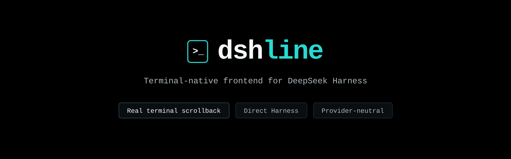
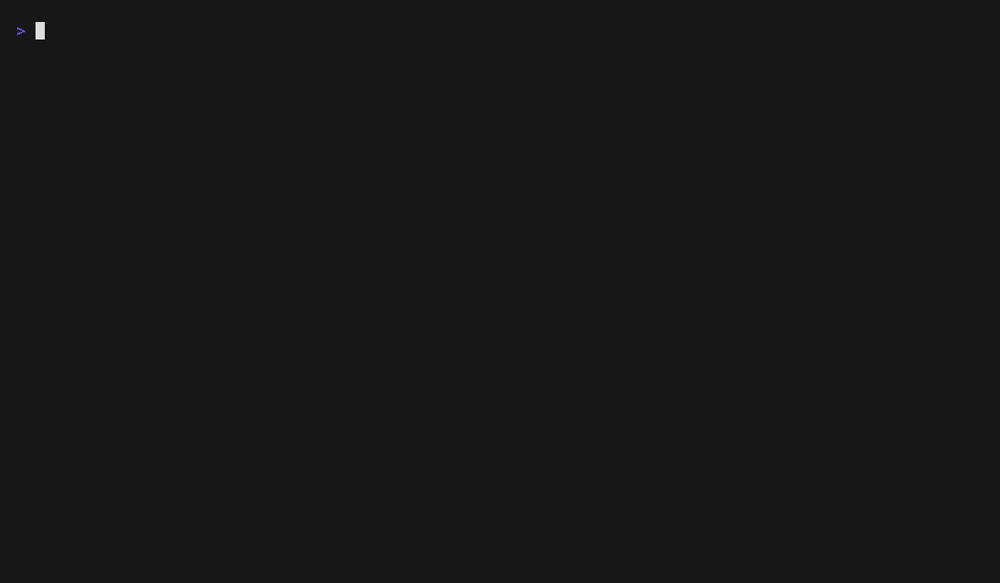

<p align="center">
  
</p>

# dshline

English | [中文](README.zh.md)

**The terminal-native frontend for the [DeepSeek Harness](https://github.com/deepseek-ai/deepseek-harness) plugin ecosystem.**

An agent in your terminal — not instead of it. Finished output stays in your terminal's own scrollback; only a bounded live region redraws.

**Website:** [dshline.xyz](https://dshline.xyz)

[](https://www.npmjs.com/package/@dshline/dshline)
[](https://github.com/riesbri/dshline/actions/workflows/ci.yml)
[](https://scorecard.dev/viewer/?uri=github.com/riesbri/dshline)
[](LICENSE)

## See it in action

<p align="center">
  
</p>

## Install

```sh
npm install -g @deepseek-ai/dsh @dshline/dshline
dshline
```

The first run asks once before letting Harness create the `dshline` profile and install this package into it. See [Install](docs/install.md) for requirements, verification, explicit setup with `dshline --setup`, and source installs.

> [!WARNING]
> Sandbox and tool permissions are controlled by the active Harness profile; ordinary tool calls may run without per-call review. See [Permissions and the sandbox](docs/usage.md#permissions-and-the-sandbox) before using dshline on important code.

## Why dshline?

Harness plugins publish capabilities; dshline presents supported capabilities natively in the terminal. It runs in-process and consumes Harness contracts rather than creating separate provider runtimes, state stores, or policy.

`Harness plugin → standard capability → dshline presentation adapter → native terminal UI`

Harness owns capabilities, state, runtime, persistence, and policy. dshline owns terminal presentation.

<p align="center">
  
</p>

### Generic capability integration

dshline integrates through standard Harness capabilities instead of provider-specific code. Work consumes `ctx.jobs` and `ctx.subagents`; Sessions uses `ctx.sessionQuery`; `/connect` uses Harness's model, settings, credentials, and authorization services; `/plugins` reads and switches the running agent's composition through `ctx.agentPresets`; `/profiles` reads the profile roster through Harness's own home-path service and forwards every change to `dsh plugin`. New providers can therefore flow through existing interfaces without requiring a dedicated dshline implementation.

It ships no provider list and no login protocol: `/connect` offers whatever the mounted adapters declare configurable and runs whatever flows Harness has registered, so the same providers are reachable from the terminal and from the official web Models page, over one settings document and one credential store.

See [Architecture](docs/architecture.md) for the capability model and current adapter boundaries.

### Native terminal by design

Finished output is committed to real terminal scrollback and never rewritten. Normal scrolling, selection, and copying keep working while dshline redraws only a bounded live region. The Harness-independent renderer stays small, dependency-light, and focused on terminal correctness: widths, Unicode, escaping, keys, and safe redraws.

See [Design](docs/design.md) for the terminal invariants and [Comparison](docs/comparison.md) for the trade-offs.

## Use dshline

Type `/` to discover the commands and capabilities available in the active Harness profile.

- `/new` — start a fresh session in the current workspace; the previous one is reopenable when the active Harness profile provides session persistence
- `/clear` — wipe the screen and start a fresh session in the current workspace, like `/new`; the previous one is reopenable when the active Harness profile provides session persistence
- `/image <path>` — stage a PNG, JPEG, WebP, or GIF as a real Harness image for the next prompt; `@path` remains a textual reference
- `/sessions` — browse and resume Harness sessions
- `/worktrees` — choose the code workspace to work in, then a conversation there or a new one
- `/work` — inspect workflows, subagents, and jobs
- `/connect` — configure providers through Harness
- `/plugins` — browse, search, and customize the running agent's Harness preset composition
- `/profiles` — browse Harness profiles and the bundles each one composes; install, update, or remove one
- `/todos` — inspect projected Todo state
- `/model` — switch registered models
- `/theme` — choose the colour palette this window draws with

[Usage](docs/usage.md) covers keys, sessions, commands, and permission guidance.

## Contributing

Contributions are welcome, especially generic capability adapters, terminal robustness, cross-platform verification, Unicode/CJK correctness, sessions, attachments, and focused UX improvements. Start with [CONTRIBUTING.md](CONTRIBUTING.md), then read [AGENTS.md](AGENTS.md) and the canonical [Roadmap](ROADMAP.md).

## Documentation

- [Install](docs/install.md)
- [Usage](docs/usage.md)
- [Architecture](docs/architecture.md)
- [Design](docs/design.md)
- [Roadmap](ROADMAP.md)
- [Comparison](docs/comparison.md)
- [Contributing](CONTRIBUTING.md)
- [Security](SECURITY.md)

## License

[MIT](LICENSE). Not affiliated with or endorsed by DeepSeek.
